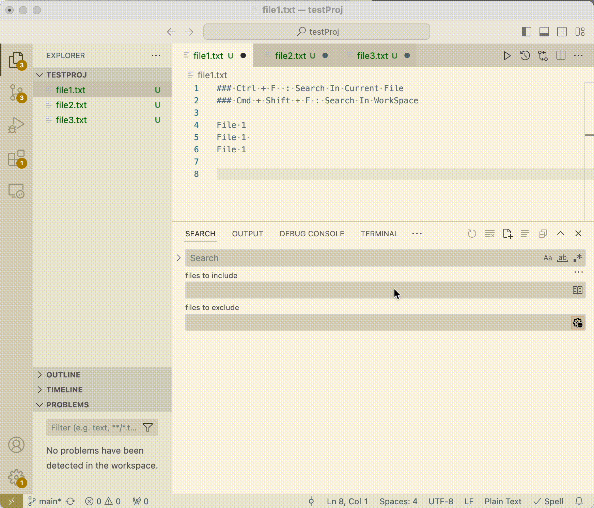

# Search in Current File Plus

This is a Visual Studio Code extension that makes it easily to search in current active editor.  It is inspired by the emacs extension helm-occur.



## Commands
### Search in Current File Plus

Search in Current File : `cmd+f` 
Search all Files : `cmd+shift+f`

## Useful Keyboard Shortcuts Example
```json
// Only type ctrl+o when using Find.
// the query in Find is filled into the query in Search.
{
    "key": "cmd+f",
    "command": "search-in-current-file.searchInCurrentFile",
    "when": "editorFocus"
  },
  {
    "key": "shift+cmd+f",
    "command": "search-in-current-file.searchInAllFiles",
},
{
    "key": "shift+cmd+m",
    "command": "workbench.action.findInFiles"
},
{
    "key": "cmd+f",
    "command": "-actions.find",
    "when": "editorFocus || editorIsOpen"
}
```
